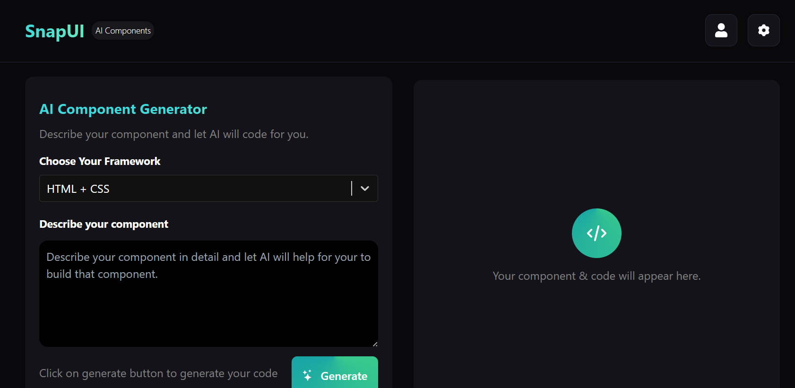

# SnapUI

🌟 Snap UI - AI powered component builder 

<p align="center">
  
</p>

---
[](https://snapui-cipher.netlify.app/)

  
[](https://github.com/Official-CIPHER/SnapUI/stargazers)  


**SnapUI**: AN AI-powered component builder to instantly generate clean, responsive UI components with live preview and production-ready code.

---

## Features

Here are the main features of SnapUI:

- **AI Component Generation**: Describe a UI or pick a template, and SnapUI will generate responsive component code automatically.  
- **Live Preview**: Instantly preview your component in a working viewport as you tweak parameters.  
- **Production-Ready Code Output**: Download or export code (e.g. React, HTML+CSS, other frameworks) for direct use.  
- **Responsive & Clean Design**: Components adapt to different screen sizes, follow clean design principles.  
- **Custom Props & Theming**: Allow customization of styles, colors, props, and theming for generated components.  
- **Export / Download**: Download code or assets (CSS, JS) of the generated UI.  

---
## Preview

<p align="center">
  <h3>Home Page </h3>
  
</p>
<p align="center">
  <h3>Snap UI Page </h3>
  
</p>

---

## Getting Started

### Prerequisites

Make sure you have:

- Node.js (v14+ or v16+ recommended)  
- npm or yarn  
- Git  

### Installation

```bash
git clone https://github.com/Official-CIPHER/SnapUI.git
cd SnapUI
npm install
```

## 📬 Contact Me  

- 📧 **Email:** vishalkumar211103@gmail.com  
- 💼 **LinkedIn:** [Your LinkedIn](https://www.linkedin.com/in/vishal-kumar-vk70/)  
- 🐙 **GitHub:** [Official-CIPHER](https://github.com/Official-CIPHER)  

---

⭐ *If you like my portfolio, please consider giving it a star! It helps a lot.*  
